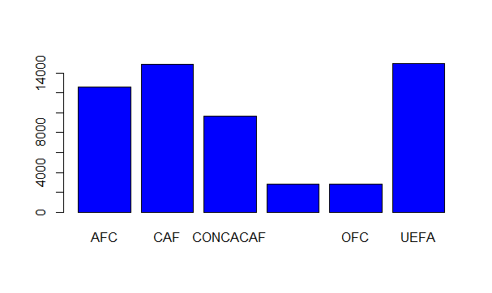

# DATA 101 Project 2
# fifaranking

Project 2 Fifa ranking was focusing on using (dplyr) and (ggplot2).

## Code and Resources Used

R Version: 3.5 

R Studio Version: 3.5 
Packages: dplyr and ggpolt2

## Model Building 

